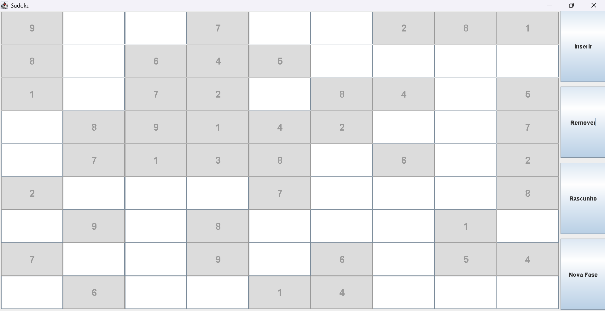

# 🧩 Jogo de Sudoku em Java (Swing)

## 📌 Descrição do Projeto
Este projeto consiste no desenvolvimento de um jogo de Sudoku utilizando a linguagem Java e a biblioteca gráfica Swing, aplicando o padrão arquitetural MVC (Model–View–Controller).

O jogo permite ao usuário interagir de forma intuitiva, inserir e remover números, utilizar rascunhos, verificar o progresso e resolver diferentes fases de Sudoku geradas automaticamente, garantindo que cada jogo seja único.

---

## 🎯 Objetivos
* Desenvolver um jogo funcional de Sudoku
* Aplicar conceitos de orientação a objetos
* Utilizar interface gráfica (Swing)
* Implementar validação de regras do Sudoku
* Criar uma boa experiência de usuário (UI/UX)

---

## 🛠️ Tecnologias Utilizadas
* Java 17+
* Swing (AWT/Swing)
* Padrão MVC
* Estruturas de dados (arrays, sets)

---

## 📂 Estrutura do Projeto
- src/
- └── br/
- └── com/
- └── sudoku/
- ├── Main.java
- ├── controller/
- │   └── SudokuController.java
- ├── model/
- │   ├── SudokuBoard.java
- │   └── SudokuGenerator.java
- └── view/
- ├── SudokuFrame.java
- └── StartScreen.java

---

## ▶️ Como Executar o Projeto
1. Abra o projeto em uma IDE Java (IntelliJ, Eclipse, VS Code)
2. Certifique-se que a pasta **src** está marcada como **Source Root**
3. Execute a classe: `br.com.sudoku.Main`
4. A tela inicial (vinheta) será exibida
5. Clique em **"Iniciar Jogo"** para começar

---

## 🎮 Funcionalidades Implementadas

### ✔️ Menu Interativo
* Inserir e remover número
* Inserir rascunhos
* Iniciar nova fase
* Finalizar jogo

### ✔️ Geração Automática de Fases
* Cada jogo é diferente
* Sudoku sempre válido
* Números iniciais são fixos

### ✔️ Regras do Sudoku
* Não permite conflitos em: Linhas, Colunas e Blocos 3x3
* Validação de jogo completo e correto

### ✔️ Rascunhos (Notas)
* Permite adicionar múltiplos números em uma célula
* Visualização em fonte menor
* Similar a jogos reais de Sudoku

### ✔️ Contador de Acertos
* Mostra quantos números o jogador já inseriu

### ✔️ Interface Gráfica (UI/UX)
* Destaque visual de células
* Separação clara dos blocos 3x3
* Cores suaves para melhor usabilidade
* Tela inicial (vinheta)

---

## 📊 Status do Jogo
O jogo pode apresentar os seguintes estados:
* Não iniciado
* Em andamento (incompleto)
* Completo
* Com ou sem erros

---

## 🧠 Padrão de Projeto Utilizado: MVC
* **Model**: Responsável pelos dados do jogo e validações (SudokuBoard, SudokuGenerator)
* **View**: Interface gráfica e interação com o usuário (SudokuFrame, StartScreen)
* **Controller**: Intermedia ações do usuário e regras do jogo (SudokuController)

---

## 📦 Histórico de Commits (Resumo)
* Estrutura inicial do projeto
* Modelo do tabuleiro Sudoku
* Interface gráfica básica
* Controller e integração MVC
* Menu interativo e validações
* Fases com geração automática
* Rascunhos, contador e vinheta inicial

---

## ✅ Conclusão
O projeto atende a todos os requisitos propostos, apresentando um jogo de Sudoku completo, funcional, com interface gráfica intuitiva, boas práticas de programação e arquitetura bem definida.

---

## 👨‍💻 Autor
Projeto desenvolvido como atividade acadêmica para fins de aprendizado em Java, Swing e arquitetura MVC.